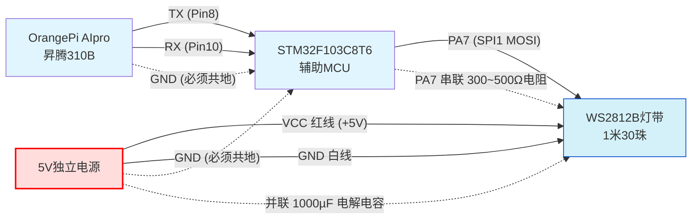

# 基于昇腾310B手势识别控制WS2812B彩灯带

## 项目简介

利用OrangePi AIpro（昇腾310B）运行YOLOv10手势识别，通过NPU加速推理，识别四种手势（点赞、握拳、掌心、剪刀手）。结果经UART串口发送至STM32F103C8T6，驱动WS2812B彩灯带实现颜色及动态特效的切换。

---

## 📋 项目计划书

### 项目概述
本项目利用OrangePi AIpro（昇腾310B）运行YOLOv10手势识别模型，识别结果通过串口发送至STM32，驱动WS2812B彩灯带实现颜色及动态特效的切换。项目由两人合作完成，分别负责AI推理与嵌入式开发。

### 时间节点与任务

| 截止时间 | 阶段任务 | 交付物 |
|----------|----------|--------|
| 06-30 09:00 | 环境搭建、物料准备 | 项目计划书 |
| 07-02 09:00 | 模型转换（ONNX→OM）、NPU推理 | 设计文档 |
| 07-06 15:00 | STM32灯带驱动、串口通信调通 | 中期检查报告 |
| 07-09 09:00 | 全流程闭环联调 | 第一次验收演示 |
| 07-10 09:00 | 最终优化与录像 | 第二次验收 |
| 验收后一周内 | 个人总结 | 个人报告（LaTeX） |

### 手势-灯光映射

| 手势 | 串口指令 | 灯带动作 |
|------|----------|----------|
| 点赞 | `CMD:ACC` | 暖色高亮 |
| 握拳 | `CMD:DEC` | 冷色低亮 |
| 掌心 | `CMD:STOP` | 全灭 |
| 剪刀手 | `CMD:REV` | 彩虹跑马灯 |

### 硬件采购清单

| 名称 | 规格 | 总价 |
|------|------|------|
| AI主板 | OrangePi AIpro (昇腾310B) | ¥680 |
| MCU | STM32F103C8T6 核心板 | ¥25 |
| 摄像头 | USB 720P (支持MJPG) | ¥80 |
| 灯带 | WS2812B (5V, 30颗/米) | ¥18 |
| 主板电源 | 12V 3A适配器 | ¥35 |
| 灯带电源 | 5V 3A独立适配器 | ¥25 |
| 串口模块 | CH340 USB转TTL | ¥12 |
| 电容 | 1000µF/16V | ¥2 |
| **总计** | | **¥927** |

> ⚠️ 灯带必须独立供电，严禁从主板取电。

### 两人分工

- **阳皓（算法与上位机）**：模型转换、NPU推理脚本、串口发送逻辑、Flask推流。
- **江宇晨（嵌入式与硬件）**：STM32驱动（SPI+DMA）、UART中断、硬件接线、灯带调试。

### 降级方案

- WebRTC推流 → Flask+MJPEG
- FreeRTOS → 裸机中断+轮询
- 模型转换报错 → 参考华为官方YOLO样例

### 准备状态自查

- [ ] 硬件已下单，预计7月1日前到货
- [ ] CANN 7.0 环境已安装
- [ ] VS Code + ARM-GCC 已测试

---

## 硬件接线

| 组件 | 规格 | 数量 | 备注 |
|------|------|------|------|
| AI计算板 | OrangePi AIpro (昇腾310B) | 1 | 预装Ubuntu 22.04 + CANN 7.0 |
| MCU | STM32F103C8T6 核心板 | 1 | 3.3V逻辑 |
| USB摄像头 | 支持MJPG，720P | 1 | 避免YUYV |
| LED灯带 | WS2812B，5V，30颗/米 | 1米 | 裸线头版本 |
| 主板电源 | 12V 3A适配器 | 1 | 为OrangePi供电 |
| 灯带电源 | 5V 3A适配器 | 1 | **独立供电，严禁共用** |
| 串口模块 | CH340 USB转TTL | 1 | 调试用 |
| 杜邦线 | 母对母/公对母各40根 | 2套 | |
| 电解电容 | 1000µF/16V | 2 | 并联于灯带VCC/GND |

**接线拓扑**：

**关键说明**：
- OrangePi AIpro UART_TX (Pin8) → STM32 RX (PA10)
- OrangePi AIpro UART_RX (Pin10) ← STM32 TX (PA9)
- STM32 PA7 (SPI1 MOSI) → WS2812B DIN（串联300~500Ω电阻）
- WS2812B VCC ← 5V独立电源；GND 共地
- 所有GND必须共地；灯带严禁从主板取电

## 软件架构

- **AI推理层（昇腾端）**：Python + OpenCV采集，Letterbox缩放至640×640，AscendCL调用NPU推理YOLOv10 OM模型，后处理解析手势类别并绘制检测框。
- **通信层**：UART串口（115200, 8N1），ASCII指令以`\r\n`结尾（如`CMD:ACC\r\n`）。
- **控制执行层（STM32）**：裸机程序，利用SPI+DMA发送编码位流驱动WS2812B（每24位RGB转72个SPI字节）。
- **推流服务（可选）**：Flask + MJPEG，浏览器实时预览。

## 手势映射表

| 手势 | 标签 | 串口指令 | 灯带动作 |
|------|------|----------|----------|
| 点赞 | 0 | `CMD:ACC` | 暖色高亮 |
| 握拳 | 1 | `CMD:DEC` | 冷色低亮 |
| 掌心 | 2 | `CMD:STOP` | 全灭 |
| 剪刀手 | 3 | `CMD:REV` | 彩虹跑马灯 |

## 部署步骤

### 昇腾端（OrangePi AIpro）
1. 安装依赖：`pip install opencv-python numpy pyserial flask`
2. 将YOLOv10导出ONNX，使用ATC转换为OM（适配Ascend310B），放入`ascend/`目录。
3. 修改`ascend/config.py`中的`SERIAL_PORT`（如`/dev/ttyS0`）。
4. 运行：`python ascend/infer.py`（按`q`退出）。
5. （可选）另开终端运行`python web/flask_stream.py`，访问`http://<IP>:5000`查看视频流。

### STM32端
1. 使用STM32CubeMX生成Makefile工程：配置USART1（115200，中断）、SPI1（主机，模式0，时钟~1.125MHz）、DMA（SPI1_TX，Normal）。
2. 将`stm32/Inc/`和`stm32/Src/`下的文件加入工程，在`main.c`中调用`UART_Init_IT()`和`WS2812_Turn_Off()`。
3. 编译：`make`，烧录（ST-Link或串口ISP）。
4. 串口助手发送`CMD:ACC\r\n`测试灯带。
