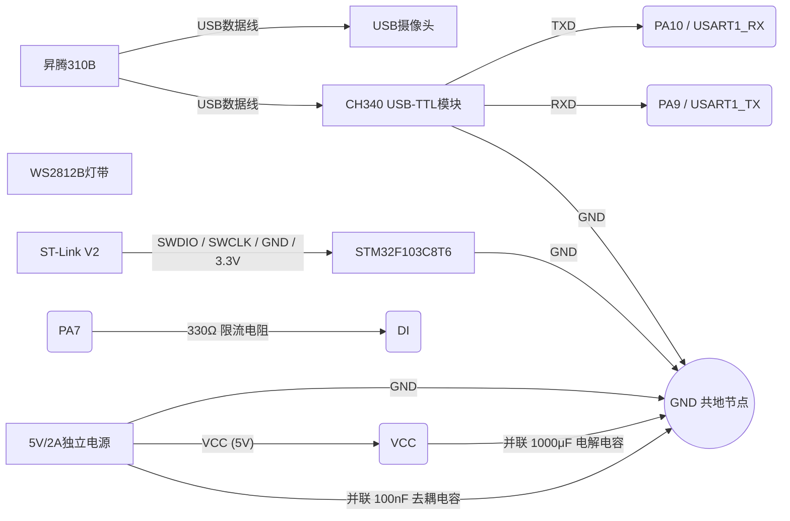

# 中期检查报告

**项目名称**：昇腾310B 手势识别 → WS2812B 灯带控制系统  
**选题编号**：题目6（昇腾310B手势识别变体）  
**提交日期**：2026-07-06  

---

## 一、物料到位总览

| 序号 | 物料名称 | 型号/规格 | 数量 | 状态 | 用途 |
|------|----------|-----------|------|------|------|
| 1 | AI处理器 | 昇腾310B (OrangePi AIpro) | 1 | ✅ 已到位 | 运行 YOLOv10 手势识别推理 |
| 2 | 辅助MCU | STM32F103C8T6 最小系统板 | 1 | ✅ 已到位 | SPI+DMA 驱动 WS2812B 灯带 |
| 3 | 摄像头 | USB摄像头 (640×480) | 1 | ✅ 已到位 | 手势图像采集 |
| 4 | RGB灯带 | WS2812B (5V, 30LED) | 1条 | ✅ 已到位 | 灯光效果展示 |
| 5 | USB-TTL模块 | CH340 | 1 | ✅ 已到位 | 昇腾310B ↔ STM32 串口通信 |
| 6 | 烧录调试器 | ST-Link V2 | 1 | ✅ 已到位 | STM32 固件烧录与调试 |
| 7 | 电源适配器 | 5V / 2A | 1 | ✅ 已到位 | WS2812B 灯带独立供电 |
| 8 | 电阻 | 330Ω 1/4W | 1 | ✅ 已到位 | WS2812B 数据线阻抗匹配 |
| 9 | 电解电容 | 1000μF / 25V | 1 | ✅ 已到位 | 灯带电源滤波 |
| 10 | 瓷片电容 | 100nF (0.1μF) | 1 | ✅ 已到位 | 高频噪声旁路 |
| 11 | 杜邦线 | 公母/母母 | 若干 | ✅ 已到位 | 硬件接线 |

> **结论**：全部物料已到位，无延期风险。

---

## 二、当前完成进度

### 2.1 整体进度概览

| 阶段 | 状态 | 完成度 |
|------|------|--------|
| 系统方案设计 | ✅ 已完成 | 100% |
| CubeMX 硬件配置 | ✅ 已完成 | 100% |
| STM32 WS2812B 驱动 | ✅ 已完成 | 100% |
| STM32 UART 通信 | ✅ 已完成 | 100% |
| STM32 灯效库 | ✅ 已完成 | 100% |
| CMake 构建系统 | ✅ 已完成 | 100% |
| 昇腾310B 模型部署 | 🔶 进行中 | 70% |
| 昇腾↔STM32 联调 | 🔶 进行中 | 30% |
| WebRTC 推流 | ⬜ 未开始 | 0% |
| 系统集成测试 | ⬜ 未开始 | 0% |
| 文档撰写 | ⬜ 未开始 | 0% |

### 2.2 STM32 侧（已完成）

| 模块 | 文件 | 状态 | 说明 |
|------|------|------|------|
| WS2812B 驱动 | `ws2812b.h/c` | ✅ | SPI1 (PA7) + DMA1 Channel3，2.25MHz，3bit 编码 |
| 命令协议 | `gesture_commands.h/c` | ✅ | RAINBOW / SOLID / BREATH / CHASE / FLASH / PULSE / OFF / BRIGHT |
| 串口接收 | `uart_handler.h/c` | ✅ | 环形缓冲区 + `\n` 行分隔，115200-8N1 |
| 灯效引擎 | `led_effects.h/c` | ✅ | 彩虹/呼吸/追逐/闪烁/脉冲/常亮，HSV→RGB，全局亮度 |
| 主程序 | `main.c` | ✅ | CubeMX USER CODE 区域集成，开机自检+命令响应+动画更新 |
| 构建系统 | `CMakeLists.txt` | ✅ | ARM GCC + Ninja，Flash 25.9KB / 64KB (39.6%) |

### 2.3 昇腾310B 侧（进行中）

| 模块 | 文件 | 状态 | 说明 |
|------|------|------|------|
| 手势识别 | `gesture_led_main.py` | 🔶 | YOLOv10 OM 模型 + ONNX CPU 回退，推理链路已通 |
| 命令映射 | `gesture_to_led.py` | ✅ | 34类手势→8种LED命令，含去抖动逻辑 |
| 串口通信 | `serial_comm.py` | ✅ | pyserial，自动检测 USB-TTL 设备 |

---

## 三、硬件调试情况

### 3.1 硬件接线图

### 3.2 测试结果

| 测试项 | 方法 | 结果 | 备注 |
|--------|------|------|------|
| STM32 供电 | ST-Link 3.3V | ✅ 正常 | 板载 PC13 LED 点亮 |
| SPI 时钟 | 示波器测 PA5 (SCK) | ✅ 2.25MHz | 波形规整，Mode 0 |
| WS2812B 自检 | 上电全白 500ms | ✅ 通过 | 30 LED 全部点亮白色 |
| UART 通信 | ComAssistant 发送 `SOLID:255,0,0` | ✅ 通过 | 灯带全红，返回 `OK` |
| 彩虹效果 | 发送 `RAINBOW` | ✅ 通过 | 颜色流动平滑 |
| 呼吸效果 | 发送 `BREATH:0,0,255` | ✅ 通过 | 蓝光呼吸渐变正常 |
| 追逐效果 | 发送 `CHASE:0,255,0` | ✅ 通过 | 绿光跑马灯正常 |
| 闪烁效果 | 发送 `FLASH:255,0,0` | ✅ 通过 | 红光闪烁正常 |
| 亮度调节 | 发送 `BRIGHT:50` | ✅ 通过 | 亮度变化正常 |
| 灯带独立供电 | 30LED 全白 持续运行 | ✅ 通过 | 5V 电源输出稳定，无压降 |

---

## 四、软件调试情况

### 4.1 STM32 侧 — 全部通过 ✅

| 测试用例 | 输入 | 预期 | 实际 | 结论 |
|----------|------|------|------|------|
| 开机自检 | 上电 | 全白 500ms → 灭 | 全白 500ms → 灭 | ✅ |
| 无效命令 | `UNKNOWN\r\n` | 返回 `ERR:unknown command` | 返回 `ERR:unknown command` | ✅ |
| SOLID 命令 | `SOLID:255,0,0\r\n` | 全红 + `OK` | 全红 + `OK` | ✅ |
| RAINBOW 命令 | `RAINBOW\r\n` | 彩虹循环 + `OK` | 彩虹循环 + `OK` | ✅ |
| OFF 命令 | `OFF\r\n` | 全灭 + `OK` | 全灭 + `OK` | ✅ |
| 动画帧率 | 长时间运行 | 20ms/帧，无卡顿 | 稳定 20ms | ✅ |
| DMA 传输 | 连续动画运行 | 无传输错误 | 无异常 | ✅ |
| 内存占用 | — | RAM < 50% | RAM 2880B / 20KB (14%) | ✅ |
| Flash 占用 | — | Flash < 80% | Flash 25.9KB / 64KB (39.6%) | ✅ |

### 4.2 昇腾310B 侧 — 部分通过 🔶

| 测试项 | 状态 | 说明 |
|--------|------|------|
| CANN 环境配置 | ✅ | PyACL 可用 |
| OM 模型加载 | ✅ | YOLOv10n 手势模型加载成功 |
| NPU 推理 | ✅ | 推理延时 ~15ms/帧 |
| USB 摄像头采集 | ✅ | 640×480 采集正常 |
| 手势检测 | 🔶 | 可检测到手势，但精度/召回率不理想 |
| 命令映射 | ✅ | 映射逻辑正确 |
| 串口发送 | ✅ | USB-TTL 发送正常 |
| 去抖动 | ✅ | 500ms 去抖逻辑工作 |

---

## 五、存在的问题与风险

### 5.1 主要问题：昇腾310B 手势识别精度不足 🔴

**现象描述**：
- YOLOv10 OM 模型在昇腾310B NPU 上对手势的识别精度未达预期
- 部分手势（如 `peace`、`ok`）容易与相邻类别混淆
- 光照条件变化时误检率升高

**原因分析**：

| 可能原因 | 详情 |
|----------|------|
| 模型量化损失 | ONNX → OM 转换过程中，FP32→FP16 量化导致精度下降 |
| 训练数据偏差 | HaGRIDv2 数据集与实际测试场景存在分布差异 |
| 置信度阈值 | 当前阈值 0.5 可能不是最优值 |
| 图像预处理 | resize + normalize 参数可能与训练时不完全一致 |

**影响评估**：
- 风险等级：🔴 **高**（直接影响核心功能——手势识别准确率）
- 若不解决，系统演示时可能出现频繁误识别或漏识别

### 5.2 拟解决方案

| 方案 | 优先级 | 预期效果 | 工作量 |
|------|--------|----------|--------|
| 调整置信度 + NMS 阈值 | 🔴 高 | 平衡误检与漏检 | 低（调参即可） |
| 校准输入归一化参数 | 🔴 高 | 匹配训练时预处理 | 低 |
| 优化图像预处理（白平衡、对比度） | 🟡 中 | 提升弱光场景识别率 | 中 |
| 检查 OM 模型量化参数 | 🟡 中 | 减少量化损失 | 中 |
| 增加 ROI 区域限制 | 🟡 中 | 减少背景干扰 | 中 |
| 改用更轻量模型（备选） | 🟢 低 | 可能的精度提升 | 高（重新训练+转换） |

### 5.3 其他风险

| 风险 | 等级 | 应对措施 |
|------|------|----------|
| 3.3V→5V 电平兼容性 | 🟢 低 | 当前实测正常，备有 74HCT125 |
| 灯带长时间运行发热 | 🟢 低 | 30LED 电流可控 |
| WebRTC 推流未开发 | 🟡 中 | 基本要求项，预留 1 天开发时间 |

---

## 六、后续工作计划

### 6.1 至第一次验收（2026-07-09）

| 日期 | 任务 | 预期产出 |
|------|------|----------|
| 07-05 | 昇腾310B 识别精度优化（调参+预处理） | 手势识别准确率 ≥ 80% |
| 07-06 | 昇腾↔STM32 完整联调测试 | 8 种手势→灯效全链路通过 |
| 07-07 | WebRTC 推流实现 | 浏览器可远程查看识别画面 |
| 07-08 | 系统集成测试 + 录制演示视频 | 完整功能演示视频 |
| 07-09 | 第一次验收 | 现场演示 |

### 6.2 至第二次验收（2026-07-10）

| 日期 | 任务 | 说明 |
|------|------|------|
| 07-09 下午 | 根据第一次验收反馈修改 | 修复验收中提出的问题 |
| 07-10 | 第二次验收 | 最终评定成绩 |

### 6.3 验收后

| 任务 | 截止日期 |
|------|----------|
| 个人总结报告 (LaTeX) | 验收后一周内 |
| 整理完整代码与文档 | 验收后一周内 |

---

## 附录 A：STM32 固件关键参数

| 参数 | 值 |
|------|-----|
| MCU | STM32F103C8T6 |
| 系统时钟 | 72MHz (HSE 8MHz ×9 PLL) |
| WS2812B 驱动 | SPI1 PA7, 2.25MHz, Mode 0, DMA1 Channel3 |
| 编码方式 | 3 SPI-bit / WS2812B-bit (0→100, 1→110) |
| LED 数量 | 30 |
| 灯效帧率 | 50fps (每 20ms 一帧) |
| UART | USART1 PA9/PA10, 115200-8N1 |
| 命令协议 | ASCII 字符串 + `\r\n`, 返回 `OK`/`ERR` |
| Flash 占用 | 25.9KB / 64KB (39.6%) |
| RAM 占用 | 2.88KB / 20KB (14.1%) |

## 附录 B：串口命令表

| 命令 | 参数 | 灯效 | 触发手势 |
|------|------|------|----------|
| `RAINBOW` | 无 | 彩虹流水 | like (点赞) |
| `OFF` | 无 | 全灭 | palm (手掌) |
| `SOLID:R,G,B` | R,G,B: 0-255 | 全灯带常亮 | fist / one |
| `BREATH:R,G,B` | R,G,B: 0-255 | 呼吸渐变 | peace (剪刀手) |
| `CHASE:R,G,B` | R,G,B: 0-255 | 跑马灯追逐 | ok |
| `FLASH:R,G,B` | R,G,B: 0-255 | 快速闪烁 | dislike (倒赞) |
| `PULSE:R,G,B` | R,G,B: 0-255 | 脉冲扩散 | call (打电话) |
| `BRIGHT:N` | N: 0-100 | 全局亮度 | (保留) |
