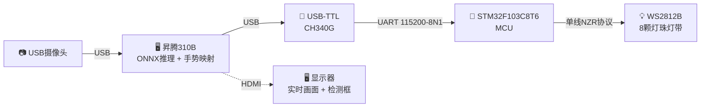
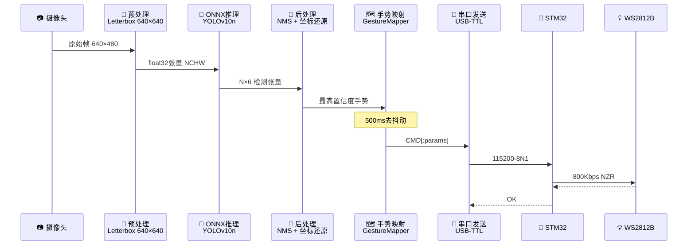
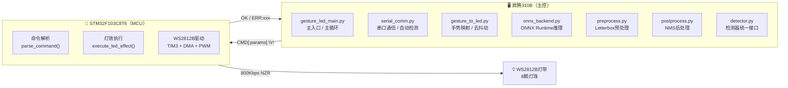
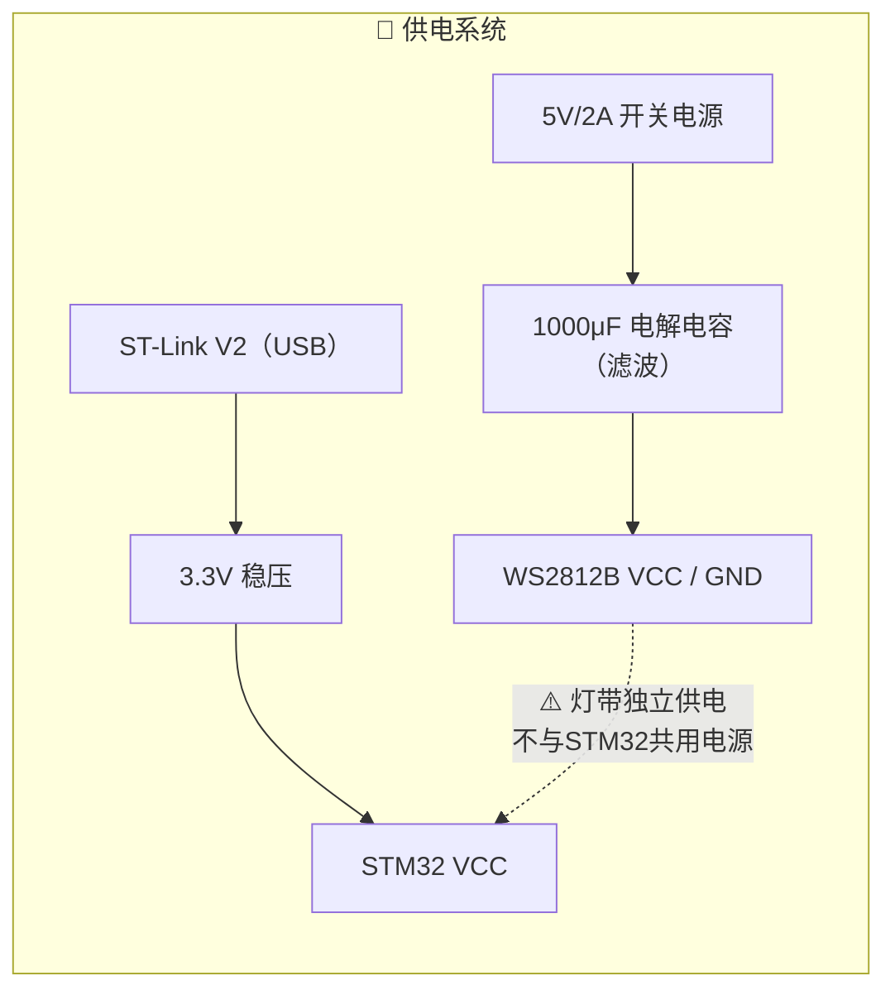

# 基于昇腾310B的实时手势识别与WS2812B灯带控制系统 —— 课程设计总结文档

> **指导老师**：周贤中  
> **专　　业**：微电子科学与工程  
> **日　　期**：2026年7月  

---

## 一、项目概述

### 1.1 项目背景

随着边缘计算与人工智能技术的快速发展，将深度学习模型部署于嵌入式设备以实现实时人机交互已成为研究热点。华为昇腾310B是一款面向边缘推理场景的AI处理器，具备**8 TOPS（INT8）** 算力，支持PyACL、ONNX Runtime等多种推理框架，非常适合部署轻量级视觉模型。

手势识别作为一种自然的人机交互方式，广泛应用于智能家居、AR/VR、机器人控制等领域。本设计将手势识别与WS2812B可编程灯带相结合，通过识别用户的手势动作实时改变灯光效果，实现了"所见即所得"的交互体验。

### 1.2 项目目标

| 序号 | 目标 |
|:----:|------|
| 1 | 在昇腾310B上部署YOLOv10n手势检测模型，实现**34类手势**的实时识别 |
| 2 | 设计并实现Python软件系统，整合图像采集、模型推理、手势映射与串口通信 |
| 3 | 搭建STM32F103C8T6 + WS2812B灯带硬件子系统，实现**12种动态灯效** |
| 4 | 通过USB-TTL串口实现昇腾310B ↔ STM32双向通信 |
| 5 | 完成系统联调与性能测试，确保端到端延迟满足实时性要求 |

### 1.3 团队成员与分工

| 姓名 | 学号 | 负责部分 | 核心工作 |
|------|------|----------|----------|
| **阳皓** | 3124009658 | **软件部分（主）** | ONNX模型推理、手势识别、Python模块设计、串口通信协议、手势-灯效映射 |
| **江宇晨** | 3124009644 | **硬件部分（副）** | STM32最小系统、WS2812B驱动电路、USB-TTL通信模块、供电方案、硬件调试 |

---

## 二、系统总体架构

### 2.1 硬件拓扑



**数据流链路**：





---

## 三、软件子系统（阳皓 · 3124009658）

### 3.1 开发环境

| 项目 | 配置 |
|------|------|
| 处理器 | 昇腾310B（ARM Cortex-A55 × 4） |
| 操作系统 | Ubuntu 22.04 (aarch64) |
| Python | 3.9.2 |
| ONNX Runtime | 1.19.2 |
| OpenCV | 4.10.0 |
| PySerial | 3.5 |
| 摄像头 | USB摄像头，640×480@30fps |

### 3.2 软件模块架构（7个模块）

| 模块 | 文件名 | 职责 |
|------|--------|------|
| 主入口 | `gesture_led_main.py` | 参数解析、主循环、模块调度 |
| 串口通信 | `serial_comm.py` | USB-TTL串口收发、自动检测 |
| 手势映射 | `gesture_to_led.py` | 手势→灯效命令映射、500ms去抖动 |
| 检测器封装 | `detector.py` | YOLO检测器统一接口 |
| ONNX后端 | `onnx_backend.py` | ONNX Runtime推理 |
| 预处理 | `preprocess.py` | Letterbox缩放、NCHW格式转换 |
| 后处理 | `postprocess.py` | 边界框解码、NMS去重、坐标还原 |

### 3.3 双模式运行

为便于分阶段调试，系统支持两种工作模式：

| 特性 | **模拟模式** | **推理模式（ONNX）** |
|------|-------------|---------------------|
| 触发方式 | 不加 `--model` 参数 | 指定 `--model xxx.onnx` |
| 手势来源 | 随机生成（70%概率显示手势） | ONNX模型真实推理 |
| 适用场景 | 串口链路/灯带硬件调试 | 端到端完整系统 |
| 串口通信 | 正常发送命令 | 正常发送命令 |
| GPU/NPU依赖 | 无 | 需ONNX Runtime |

**命令行示例**：

```bash
# 模拟模式（测试通信链路）
python3 gesture_led_main.py

# ONNX推理模式
python3 gesture_led_main.py --model models/YOLOv10n_gestures.onnx

# 自定义参数
python3 gesture_led_main.py --port /dev/ttyUSB0 --camera 0 \
    --conf 0.25 --debounce 500 --camera-width 640 --camera-height 480
```

### 3.4 主循环设计

主循环遵循 `采集 → 推理 → 映射 → 发送 → 渲染` 的流水线模式。关键设计包括：

- **信号处理**：注册 `SIGINT` 和 `SIGTERM` 信号处理器，确保 `Ctrl+C` 可安全退出
- **多通道退出**：支持 `q` 键（OpenCV窗口）、`Ctrl+C`（终端信号）、回车键（SSH无GUI场景）三种退出方式
- **模拟模式定时切换**：每1.5秒随机切换手势，70%时间显示手势、30%时间显示空手势
- **手动测试模式**：按 `t` 键进入，终端直发命令调试灯带，输入 `/quit` 退出
- **实时状态反馈**：OpenCV窗口实时显示FPS、推理延迟、当前LED命令、STM32响应状态、检测手势名称

### 3.5 ONNX推理流程

**模型信息**：YOLOv10n手势检测模型，输入尺寸 640×640×3，输出 N×6 检测张量（x₁, y₁, x₂, y₂, score, class_id）。

**推理后端配置**：

```python
class OnnxBackend:
    def __init__(self, model_path, provider="CPUExecutionProvider"):
        sess_opt = ort.SessionOptions()
        sess_opt.intra_op_num_threads = 3      # 使用3个CPU线程
        sess_opt.inter_op_num_threads = 1
        sess_opt.graph_optimization_level = ort.GraphOptimizationLevel.ORT_ENABLE_ALL
        self.session = ort.InferenceSession(str(model_path),
            sess_options=sess_opt, providers=[provider])
```

**处理流水线**（5步后处理）：

| 步骤 | 操作 | 说明 |
|:----:|------|------|
| 1 | 输出规整化 | 处理YOLOv10的 N×6 输出格式 |
| 2 | 置信度过滤 | 筛选 score ≥ conf_threshold 的检测框 |
| 3 | 坐标还原 | 将Letterbox坐标系映射回原始图像坐标系 |
| 4 | NMS去重 | 使用OpenCV的 `dnn.NMSBoxes` 执行非极大值抑制 |
| 5 | 结果组装 | 输出 [x₁, y₁, x₂, y₂, score, class_id] 格式 |

**最优手势选取**：每帧取置信度最高的检测结果，传入GestureMapper。

### 3.6 HaGRID标签体系

系统使用HaGRIDv2数据集定义的**34类手势标签**：

```
grabbing, grip, holy, point, call, three3, timeout, xsign,
hand_heart, hand_heart2, little_finger, middle_finger, take_picture,
dislike, fist, four, like, mute, ok, one,
palm, peace, peace_inverted, rock, stop, stop_inverted,
three, three2, two_up, two_up_inverted,
three_gun, thumb_index, thumb_index2, no_gesture
```

其中 **11个手势**（含 stop/palm 合并）映射到灯效命令，其余23类作为扩展预留。

---

## 四、硬件子系统（江宇晨 · 3124009644）

### 4.1 硬件组件清单

| 组件 | 型号/规格 | 用途 |
|------|----------|------|
| 微控制器 | STM32F103C8T6（Blue Pill） | 串口解析 + 灯带驱动 |
| USB-TTL模块 | CH340G | 昇腾310B ↔ STM32 串口桥接 |
| LED灯带 | WS2812B，8颗灯珠 | 可编程RGB灯效（5V供电） |
| 烧录调试器 | ST-Link V2 | STM32固件烧录与调试 |
| 外部电源 | 5V/2A 开关电源 | WS2812B灯带独立供电 |
| 电解电容 | 1000μF/16V | 灯带电源滤波 |
| 限流电阻 | 330Ω | 数据线限流保护 |

### 4.2 STM32F103C8T6 引脚分配

| GPIO | 功能 | 连接目标 | 说明 |
|------|------|----------|------|
| PA2 | USART2_TX | USB-TTL RXD | 串口发送（→ 昇腾310B） |
| PA3 | USART2_RX | USB-TTL TXD | 串口接收（← 昇腾310B） |
| PA7 | TIM3_CH2 | WS2812B DI | PWM/SPI模拟单线协议 |
| PA13 | SWDIO | ST-Link V2 | 调试接口数据线 |
| PA14 | SWCLK | ST-Link V2 | 调试接口时钟线 |
| PC13 | LED (OUT) | 板载LED | 心跳指示 |

**芯片特性**：ARM Cortex-M3内核，72MHz主频，3×USART，4×定时器，64KB Flash，20KB SRAM。

### 4.3 USB-TTL通信模块

**选型理由**（CH340G）：
1. 昇腾310B的Linux系统内置CH340驱动，即插即用
2. 3.3V TTL电平与STM32完全兼容，无需电平转换
3. 支持115200bps及更高波特率
4. 成本低、体积小

**交叉接线规则**：
> ⚠️ CH340的TXD → STM32的RX（PA3），CH340的RXD → STM32的TX（PA2）——通信双方的TX/RX必须**交叉连接**。

### 4.4 WS2812B灯带驱动

#### 电气特性

| 参数 | 规格 |
|------|------|
| 工作电压 | 3.5–5.3V |
| 单颗最大电流 | ~60mA（RGB全亮白色） |
| 数据传输速率 | 800Kbps |
| 数据协议 | NZR单线归零码 |
| 级联方式 | DI → DO 串行级联 |

#### NZR单线通信协议

| 信号 | 高电平 | 低电平 |
|------|--------|--------|
| **0码** | 0.4μs | 0.85μs |
| **1码** | 0.8μs | 0.45μs |
| **RESET** | — | >50μs（帧间隔） |

每颗灯珠需要24位数据（G:R:B各8位），8颗灯珠需192位数据。

**驱动方式**：STM32的TIM3定时器 + DMA产生精确的800Kbps NZR时序信号，PWM占空比区分0/1码，DMA批量传输实现**CPU零干预**的灯带刷新。

### 4.5 供电方案



**供电安全要点**：

| 要点 | 说明 |
|------|------|
| 灯带独立供电 | WS2812B使用独立5V/2A电源，不通过STM32供电，避免大电流损坏MCU的3.3V LDO |
| 电源滤波 | 1000μF电解电容并联在灯带电源输入端，滤除LED切换时的瞬态噪声 |
| STM32供电 | 通过ST-Link V2的USB口供电（3.3V），与灯带电源隔离 |
| 共地 | 所有设备的GND必须共地，形成统一的参考电平 |
| 限流保护 | PA7与WS2812B的DI之间串联330Ω电阻，抑制信号反射、保护IO口 |

### 4.6 STM32固件概要

**主程序流程（前后台架构）**：

```c
int main(void) {
    HAL_Init();
    SystemClock_Config();
    MX_USART2_UART_Init();    // USART2: 115200-8-N-1
    MX_TIM3_Init();           // TIM3 CH2 for WS2812B

    while (1) {
        if (uart_rx_complete) {           // 收到完整命令帧
            parse_command(rx_buffer);     // 解析命令
            execute_led_effect();         // 执行对应灯效
            uart_send_response("OK\r\n"); // 回复确认
            uart_rx_complete = 0;
        }
        update_led_animation();           // 更新动画帧（定时器驱动）
    }
}
```

**命令解析**：命令格式 `CMD[:param1,param2,param3]`，帧以 `\r\n` 结尾，兼容 `\r`、`\n`、`\r\n` 三种换行符。

---

## 五、串口通信协议

### 5.1 物理层规格

| 参数 | 值 |
|------|-----|
| 物理接口 | USB-TTL（CH340G） |
| 电平标准 | 3.3V TTL |
| 波特率 | 115200 bps |
| 数据位 | 8 |
| 校验位 | 无（None） |
| 停止位 | 1 |
| 帧结尾 | `\r\n` |

### 5.2 命令协议

命令采用 `CMD[:params]` 文本格式，参数以逗号分隔：

| 命令 | 参数 | 说明 |
|------|------|------|
| `RAINBOW` | 无 | 彩虹流水灯效 |
| `OFF` | 无 | 全部熄灭 |
| `SOLID` | R,G,B (0–255) | 常亮指定颜色 |
| `BREATH` | R,G,B | 呼吸灯效 |
| `CHASE` | R,G,B | 追逐灯效 |
| `FLASH` | R,G,B | 闪烁灯效 |
| `PULSE` | R,G,B | 脉冲灯效 |
| `BRIGHT` | 0–100 | 亮度百分比 |

**响应格式**：成功返回 `OK`，失败返回 `ERR:xxx`。

---

## 六、手势-灯效映射表

系统定义了 **11种手势 → 12种灯效**（含 stop/palm 合并）的完整映射关系：

| HaGRID手势 | 手势含义 | 串口命令 | 灯效描述 | 颜色 |
|:----------:|:--------:|----------|----------|:----:|
| `like` | 点赞 👍 | `RAINBOW` | 🌈 彩虹流水 | 七彩 |
| `palm` / `stop` | 手掌/停止 ✋ | `OFF` | ⚫ 全灭 | — |
| `fist` | 握拳 ✊ | `SOLID:255,0,0` | 🔴 红色常亮 | 红 |
| `one` | 食指 ☝️ | `SOLID:255,255,255` | ⚪ 白色常亮 | 白 |
| `peace` | 剪刀手 ✌️ | `BREATH:0,0,255` | 🔵 蓝色呼吸 | 蓝 |
| `peace_inverted` | 反剪刀手 | `BREATH:255,0,255` | 🟣 紫色呼吸 | 紫 |
| `ok` | OK手势 👌 | `CHASE:0,255,0` | 🟢 绿色追逐 | 绿 |
| `dislike` | 踩 👎 | `FLASH:255,0,0` | 🔴 红色闪烁 | 红 |
| `rock` | 摇滚 🤘 | `FLASH:255,255,0` | 🟡 黄色闪烁 | 黄 |
| `call` | 打电话 🤙 | `PULSE:128,0,255` | 🟣 紫色脉冲 | 紫 |
| `mute` | 静音 🤫 | `SOLID:128,128,128` | ⬜ 暗白常亮 | 暗白 |

### 去抖动算法

为避免手势识别瞬时抖动导致灯效频繁切换，实现了**500ms时间窗口去抖动机制**：

1. **手势变化检测**：当检测到手势与上一次不同时，重置稳定计时器，不触发命令
2. **稳定阈值判断**：同一手势需连续出现超过 `debounce_ms`（默认500ms）才认为"稳定"
3. **重复命令抑制**：连续检测到同一手势时，仅首次发送命令，避免重复通信

---

## 七、测试与验证

### 7.1 软件测试结果（阳皓）

| 测试项 | 结果 | 说明 |
|--------|:----:|------|
| 串口自动检测（USB-TTL） | ✅ | 自动识别 `/dev/ttyUSB0` |
| 串口双向通信 | ✅ | TX发命令，RX收 `OK` |
| 板载UART通信 | ❌ | 只能发不能收，改用USB-TTL |
| HDMI显示输出 | ✅ | 1920×1080@60Hz |
| 摄像头采集 | ✅ | 640×480@30fps |
| ONNX模型加载 | ✅ | YOLOv10n_gestures.onnx |
| ONNX推理延迟 | ~120ms | 单帧CPU推理 |
| 模拟模式-手势生成 | ✅ | 每1.5s随机切换 |
| 模拟模式-去抖动 | ✅ | 500ms稳定后触发 |
| 模拟模式-灯效控制 | ✅ | 12种灯效全部正常切换 |
| 模拟模式-STM32响应 | ✅ | 每条命令返回 `OK` |
| 手动测试模式 | ✅ | 终端直发12种命令全通过 |

### 7.2 硬件测试结果（江宇晨）

| 测试项 | 结果 | 说明 |
|--------|:----:|------|
| 5V供电稳定性 | ✅ | 5.02V，纹波 < 50mV |
| STM32最小系统启动 | ✅ | PC13心跳灯亮 |
| 串口双向通信（USB-TTL） | ✅ | TX发 → RX收 `OK` |
| 灯带彩虹流水灯效 | ✅ | 色彩过渡平滑 |
| 灯带全灭灯效 | ✅ | 所有灯珠熄灭 |
| 灯带常亮灯效（6色） | ✅ | 红/白/暗白 颜色准确 |
| 灯带呼吸灯效（2色） | ✅ | 蓝/紫呼吸平滑 |
| 灯带追逐灯效 | ✅ | 绿色追逐流畅 |
| 灯带闪烁灯效（2色） | ✅ | 红/黄闪烁节奏正确 |
| 灯带脉冲灯效 | ✅ | 紫色脉冲频率合适 |
| **端到端手势→灯效** | ✅ | **软件+硬件联调通过** |

### 7.3 性能分析

| 指标 | 数值 |
|------|------|
| 单帧ONNX推理延迟 | ~120ms |
| 预处理+后处理 | ~5ms |
| 串口通信延迟 | ~2ms |
| **端到端总延迟** | **~127ms** |
| 优化后CPU占用率 | ~33%（使用 `--infer-every-n 3`） |

---

## 八、硬件调试常见问题与解决

| 问题 | 原因 | 解决方案 |
|------|------|----------|
| 灯带不亮 | 供电不足或未共地 | 检查5V供电，确认GND连通 |
| 串口通信单向不通 | TX/RX未交叉连接 | 交换TXD和RXD接线 |
| 灯带颜色异常 | 数据线过长或干扰 | 缩短数据线，加330Ω电阻 |
| 第一颗灯珠异常 | DI端电平不确定 | DI端加1kΩ上拉到5V |
| STM32无响应 | 未上电或固件烧录失败 | 检查ST-Link，确认PC13亮 |
| 板载UART无法通信 | 引脚映射不正确 | 改用USB-TTL模块 |

---

## 九、软件分步调试流程

| 步骤 | 内容 | 目的 |
|:----:|------|------|
| 第1步 | **串口直发测试** | 终端用 `echo` 直发指令，验证串口链路和STM32响应 |
| 第2步 | **模拟模式测试** | 运行主程序（不加 `--model`），验证通信和映射模块 |
| 第3步 | **ONNX推理测试** | 加载YOLOv10n模型，验证推理延迟和后处理正确性 |
| 第4步 | **端到端联调** | 完整系统运行，用手势控制灯带，验证去抖动和命令映射 |
| 第5步 | **手动测试模式** | 按 `t` 键逐条测试所有12种灯效命令 |

---

## 十、总结与展望

### 10.1 主要成果

| # | 成果 |
|:--:|------|
| 1 | 成功在昇腾310B上部署YOLOv10n手势检测模型，支持**34类手势**实时识别 |
| 2 | 实现了**11种手势→12种灯效**的完整映射，含500ms去抖动机制 |
| 3 | 设计了USB-TTL串口通信协议（115200-8N1），实现昇腾↔STM32的**双向通信** |
| 4 | 搭建了STM32+WS2812B硬件子系统，含独立供电、信号滤波、限流保护 |
| 5 | 支持**模拟模式**和**ONNX推理模式**双模式运行，便于分阶段调试 |
| 6 | 端到端总延迟约**127ms**，满足实时交互需求 |
| 7 | 全部测试项通过，软件+硬件联调成功 |

### 10.2 未来展望

| 方向 | 内容 | 预期效果 |
|------|------|----------|
| **NPU加速** | ONNX模型转OM格式，利用昇腾310B的NPU推理 | 推理延迟降至 **10–20ms** |
| **WebRTC推流** | 集成aiortc，将推理画面实时推流至浏览器端 | 实现远程监控和移动端访问 |
| **更多手势** | 扩展34类手势到48类（含左右手区分） | 增加渐变、音乐律动等新灯效 |
| **多灯带控制** | 支持多个WS2812B灯带级联控制 | 实现更丰富的灯光场景 |

---

## 附录：项目文件结构

```
2026课程设计/
├── 阳皓——3124009658.tex          # 软件部分 LaTeX 报告
├── 阳皓——3124009658.pdf          # 软件部分 PDF 输出
├── 江宇晨——3124009644.tex         # 硬件部分 LaTeX 报告
├── 江宇晨——3124009644.pdf         # 硬件部分 PDF 输出
├── 项目总结文档.md               # 本文档
├── ascend310b/                   # 昇腾310B 软件源码
│   ├── gesture_led_main.py       # 主入口
│   ├── gesture_to_led.py         # 手势-灯效映射
│   ├── serial_comm.py            # 串口通信模块
│   └── requirements.txt          # Python 依赖
├── stm32_ws2812b/               # STM32 固件源码
│   ├── Core/
│   │   ├── Inc/
│   │   │   ├── gesture_commands.h
│   │   │   ├── led_effects.h
│   │   │   ├── uart_handler.h
│   │   │   └── ws2812b.h
│   │   └── Src/
│   │       ├── gesture_commands.c
│   │       ├── led_effects.c
│   │       ├── main.c
│   │       ├── uart_handler.c
│   │       └── ws2812b.c
└── docs/
    └── 设计文档.md
```

---

> 📝 **文档说明**：本文档基于阳皓（3124009658，软件部分）和江宇晨（3124009644，硬件部分）的课程设计报告综合整理而成，涵盖系统架构、软硬件设计、通信协议、测试结果等全部核心内容。本文档为Markdown格式，可用任意Markdown阅读器或GitHub直接渲染查看。
