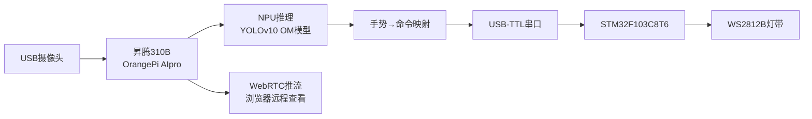
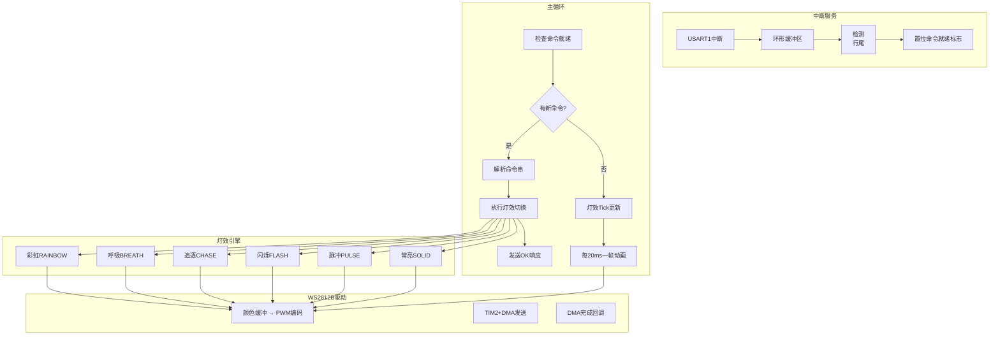
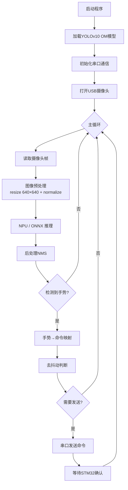

# 昇腾310B手势识别 → WS2812B灯带控制系统设计文档

## 1. 系统概述

### 1.1 项目背景

本系统是"2026嵌入式系统课程设计——题目6：昇腾310B手势识别"的变体实现，将原题目的**风扇控制**改为**WS2812B RGB LED灯带控制**。系统通过昇腾310B运行YOLOv10手势识别模型，将识别到的手势类别映射为灯光效果命令，通过串口发送至STM32F103C8T6，由STM32驱动WS2812B灯带呈现对应的动态灯光效果。

### 1.2 系统架构



## 2. 硬件设计

### 2.1 器件清单

| 器件 | 型号/规格 | 数量 | 用途 |
|------|-----------|------|------|
| AI处理器 | 昇腾310B (OrangePi AIpro) | 1 | 手势识别推理 |
| 辅助MCU | STM32F103C8T6最小系统板 | 1 | 灯带控制 |
| 摄像头 | USB摄像头 (640×480+) | 1 | 图像采集 |
| 灯带 | WS2812B RGB LED (5V, 30/60LED) | 1条 | 灯光效果展示 |
| USB-TTL模块 | CH340/CP2102 | 1 | 昇腾310B ↔ STM32串口通信 |
| 电源 | 5V/2A 适配器 | 1 | WS2812B独立供电 |
| 杜邦线 | 母对母/公对母 | 若干 | 接线 |

### 2.2 硬件接线图

```
┌──────────────────────────────────────────────────────────────┐
│                      昇腾310B (OrangePi AIpro)                │
│  USB口 ──→ USB摄像头                                         │
│  USB口 ──→ USB-TTL模块 (CH340)                                │
│             ├── TXD ──────────────→ PA10 (USART1_RX) STM32   │
│             ├── RXD ──────────────→ PA9  (USART1_TX) STM32   │
│             └── GND ──────────────→ GND              STM32   │
└──────────────────────────────────────────────────────────────┘

┌──────────────────────────────────────────────────────────────┐
│                      STM32F103C8T6                            │
│  PA0  (TIM2_CH1) ──→ WS2812B DI (数据输入)                    │
│  PA9  (USART1_TX) ──→ USB-TTL RXD                            │
│  PA10 (USART1_RX) ──→ USB-TTL TXD                            │
│  GND              ──→ USB-TTL GND + WS2812B GND               │
└──────────────────────────────────────────────────────────────┘

┌──────────────────────────────────────────────────────────────┐
│                     WS2812B 灯带                              │
│  VCC (5V) ──→ 外部5V电源正极                                  │
│  GND     ──→ 外部5V电源负极 + STM32 GND (共地必须!)           │
│  DI      ──→ STM32 PA0                                        │
│                                                                 │
│  ⚠️ 注意: WS2812B灯带功耗较大 (60mA/LED @全白)                │
│     30颗LED全白 ≈ 1.8A，必须使用外部5V电源独立供电!           │
└──────────────────────────────────────────────────────────────┘
```

### 2.3 WS2812B关键参数

| 参数 | 值 |
|------|-----|
| 工作电压 | 5V DC |
| 单颗LED最大电流 | 60mA (RGB全亮) |
| 数据协议 | 单线归零码，800kHz |
| 0码 | 0.4μs高 + 0.85μs低 |
| 1码 | 0.8μs高 + 0.45μs低 |
| RESET | >50μs低电平 |
| 颜色顺序 | GRB (绿→红→蓝) |

## 3. 软件设计

### 3.1 通信协议

昇腾310B与STM32之间通过UART串口通信，协议如下：

- **物理层**: UART 115200-8-N-1
- **帧格式**: ASCII字符串，以 `\r\n` 结尾
- **响应**: STM32正确接收后返回 `OK\r\n`，错误返回 `ERR:xxx\r\n`

#### 命令表

| 命令 | 参数 | 灯效描述 | 触发手势 |
|------|------|----------|----------|
| `RAINBOW` | 无 | 彩虹流水效果 | like (点赞) |
| `OFF` | 无 | 关闭所有LED | palm (手掌), stop |
| `SOLID:R,G,B` | R,G,B: 0-255 | 全灯带常亮指定颜色 | fist (握拳→红色), one (食指→白色) |
| `BREATH:R,G,B` | R,G,B: 0-255 | 呼吸渐变效果 | peace (剪刀手→蓝色) |
| `CHASE:R,G,B` | R,G,B: 0-255 | 跑马灯追逐效果 | ok |
| `FLASH:R,G,B` | R,G,B: 0-255 | 快速闪烁效果 | dislike (倒赞→红色) |
| `PULSE:R,G,B` | R,G,B: 0-255 | 脉冲扩散效果 | call (打电话→紫色) |
| `BRIGHT:N` | N: 0-100 | 设置全局亮度 | (保留) |

### 3.2 STM32软件架构



#### FreeRTOS任务划分（可选升级）

如果后续需要增加更多功能（如OLED显示、按键交互），可迁移到FreeRTOS：

| 任务 | 优先级 | 周期 | 功能 |
|------|--------|------|------|
| UART_Rx_Task | 高 | 事件驱动 | 串口接收与命令解析 |
| LED_Effect_Task | 中 | 20ms | 灯效动画帧更新 |
| Status_Task | 低 | 500ms | 状态LED闪烁、心跳 |

### 3.3 WS2812B驱动原理

采用 **PWM + DMA** 方案，利用STM32定时器的PWM输出配合DMA，精确生成WS2812B所需的时序信号。

- **TIM2时钟**: 72MHz (APB1×2)
- **PWM频率**: 72MHz / 90 = **800kHz**
- **每bit占1个PWM周期** (1.25μs)
- **0码**: CCR=29, 高电平 29/90 × 1.25μs ≈ 0.4μs ✓
- **1码**: CCR=58, 高电平 58/90 × 1.25μs ≈ 0.8μs ✓
- **RESET**: 50个周期输出CCR=0 → 50 × 1.25μs = 62.5μs > 50μs ✓

DMA将预先编码好的PWM占空比数组一次性发送到TIM2的CCR寄存器，无需CPU干预即可生成精确的时序。

### 3.4 昇腾310B软件流程



## 4. 关键代码说明

### 4.1 STM32侧文件结构

```
stm32_ws2812b/
├── Core/
│   ├── Inc/
│   │   ├── ws2812b.h          # WS2812B驱动接口
│   │   ├── gesture_commands.h  # 命令协议定义
│   │   ├── uart_handler.h      # 串口接收处理
│   │   └── led_effects.h       # 灯效动画库
│   └── Src/
│       ├── main.c              # 主程序
│       ├── ws2812b.c           # WS2812B驱动实现
│       ├── gesture_commands.c  # 命令解析
│       ├── uart_handler.c      # 环形缓冲+命令提取
│       └── led_effects.c       # 6种灯效实现
```

### 4.2 昇腾310B侧文件结构

```
ascend310b/
├── gesture_led_main.py    # 主控程序（识别+控制）
├── serial_comm.py         # 串口通信封装
├── gesture_to_led.py      # 手势→命令映射表
└── requirements.txt       # Python依赖
```

### 4.3 CubeMX配置要点

1. **System Core → SYS**: Debug = Serial Wire
2. **System Core → RCC**: HSE = Crystal/Ceramic Resonator
3. **Clock Configuration**: HSE(8MHz) → PLL×9 → SYSCLK=72MHz, APB1=36MHz, APB2=72MHz
4. **Timers → TIM2**: Channel1 = PWM Generation CH1, Prescaler=0, ARR=89
5. **DMA Settings (TIM2_CH1)**: DMA1 Channel5, Memory-to-Peripheral, Half Word
6. **Connectivity → USART1**: Mode=Asynchronous, Baud=115200, 8N1, NVIC中断使能

## 5. 运行步骤

### 5.1 STM32侧

1. 使用STM32CubeMX按上述配置生成工程
2. 将 `stm32_ws2812b/Core/` 下的文件复制到工程对应目录
3. 在 `stm32f1xx_it.c` 中添加回调函数调用：
   ```c
   void USART1_IRQHandler(void)
   {
       HAL_UART_IRQHandler(&huart1);
   }
   void DMA1_Channel5_IRQHandler(void)
   {
       HAL_DMA_IRQHandler(&hdma_tim2_ch1);
   }
   ```
4. 编译烧录到STM32F103C8T6

### 5.2 昇腾310B侧

```bash
# 1. 进入项目目录
cd ascend310b/

# 2. 安装依赖
pip install -r requirements.txt

# 3. 设置CANN环境（昇腾310B上）
source /usr/local/Ascend/ascend-toolkit/set_env.sh

# 4. 转换模型（如需要）
# atc --model=yolov10n_gestures.onnx --framework=5 --output=yolov10n_gestures --soc_version=Ascend310B4

# 5. 列出可用串口
python gesture_led_main.py --list-ports

# 6. 运行主程序
python gesture_led_main.py --model yolov10n_gestures.om --port /dev/ttyUSB0

# 7. 测试模式（无摄像头）
python gesture_led_main.py --test --port /dev/ttyUSB0
```

### 5.3 调试技巧

1. **串口调试**: 使用PC串口助手连接USB-TTL模块，直接发送命令测试STM32
2. **逐级验证**: 先用测试模式验证串口通信 → 再用摄像头验证手势识别 → 最后联调
3. **灯带不亮检查**:
   - 外部5V供电是否正常
   - 共地是否连接
   - DI数据线方向是否正确（灯带有输入/输出方向）

## 6. 手势映射总表

| YOLOv10手势 | 中文含义 | LED命令 | 灯光效果 |
|------------|----------|---------|----------|
| like | 点赞👍 | RAINBOW | 🌈 彩虹流水 |
| palm | 手掌✋ | OFF | ⚫ 全灭 |
| fist | 握拳✊ | SOLID:255,0,0 | 🔴 红色常亮 |
| peace | 剪刀手✌️ | BREATH:0,0,255 | 🔵 蓝色呼吸 |
| ok | OK👌 | CHASE:0,255,0 | 🟢 绿色追逐 |
| one | 食指☝️ | SOLID:255,255,255 | ⚪ 白光 |
| dislike | 倒赞👎 | FLASH:255,0,0 | 🔴 红色闪烁 |
| call | 打电话🤙 | PULSE:128,0,255 | 🟣 紫色脉冲 |
| stop | 停止🤚 | OFF | ⚫ 全灭 |
| peace_inv | 反剪刀手 | BREATH:255,0,255 | 🟣 紫色呼吸 |
| rock | 摇滚🤘 | FLASH:255,255,0 | 🟡 黄色闪烁 |
| mute | 静音 | SOLID:128,128,128 | ⚪ 暗白 |
| no_gesture | 无手势 | — | 保持当前 |
